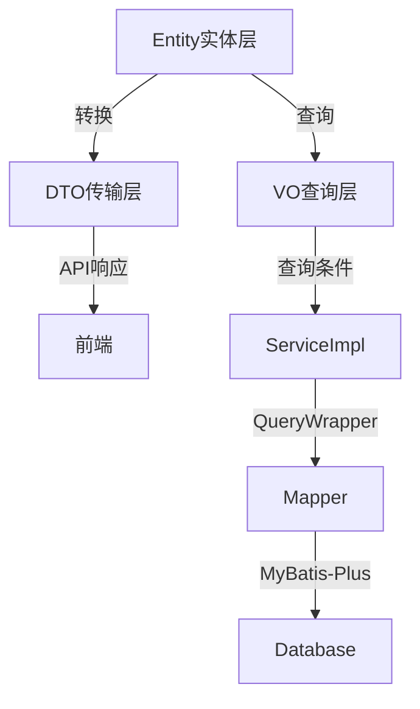

# 发现页面模块架构设计文档 v2.0 - 补充文档

> **本文档是《发现页面模块架构设计文档v2.0.md》的补充部分**

---

## 🚨 重要更新说明（2025年9月30日）

### ✅ 本次更新重点：强化主文件优先原则

基于核心架构标准UNIVERSAL_COMPONENT_ARCHITECTURE_CORE v2.5的要求，本文档已进行重大更新：

**🎯 强化的核心原则：**
1. **❌ 严禁过度文件拆分** - 禁止为状态、事件、工具函数创建独立文件
2. **✅ 主文件集中管理** - 所有逻辑必须集中在主文件的八段式结构中
3. **⚠️ 有限例外情况** - 仅设备权限、复杂算法等极少数情况可抽离

**🚫 明确禁止创建的文件：**
- ❌ useDiscoveryState.ts、useMainPageData.ts、usePublishFlow.ts
- ❌ utilsFormat.ts、utilsDisplay.ts、utilsHelper.ts
- ❌ processData.ts、processValidation.ts
- ❌ onClickHandlers.ts、eventHandlers.ts

**✅ 正确的实现方式：**
- ✅ 状态管理 → 主文件第6段（State Management）
- ✅ 工具函数 → 主文件第5段（Utils & Helpers）
- ✅ 事件处理 → 主文件第7段（Domain Logic）

---

## 📋 补充内容目录

1. 前端API接口层完整实现
2. 后端交互层完整实现
3. 八段式代码结构示例
4. **状态管理策略（强化版 - 主文件优先）** ⭐
5. 错误处理与边界情况
6. 性能优化实施方案
7. **实施检查清单（新增主文件集中化检查）** ⭐

---

## 🌐 四、前端API接口层完整实现

[详细内容请参考主文档第四章]

### 补充说明

所有API接口都已在主文档中定义完成，包含：
- ✅ apiDiscoveryMain.ts - 动态流API
- ✅ apiDiscoveryDetail.ts - 详情API
- ✅ apiDiscoveryTopic.ts - 话题API  
- ✅ apiDiscoveryPublish.ts - 发布API
- ✅ apiDiscoveryComment.ts - 评论API
- ✅ apiDiscoveryInteraction.ts - 互动API
- ✅ apiDiscoveryReport.ts - 举报API

---

## 🔌 五、后端交互层完整实现

[详细内容请参考主文档第五章]

### 补充：完整的实体-DTO-VO映射关系



---

## 📝 六、八段式代码结构完整示例

[主文件示例已在主文档第六章中提供]

### 6.2 区域组件示例（FeedCard/index.tsx）

```typescript
// #region 1. File Banner & TOC
/**
 * 动态卡片组件 - 动态内容展示
 * 
 * TOC:
 * [1] Imports
 * [2] Types & Schema
 * [3] Constants & Config
 * [4] Utils & Helpers
 * [5] State Management
 * [6] Domain Logic
 * [7] UI Components & Rendering
 * [8] Exports
 */
// #endregion

// #region 2. Imports
import React, { useState, useCallback } from 'react';
import { View, Text, TouchableOpacity, Image } from 'react-native';
import { FeedCardProps } from '../../types';
import { COLORS, UI_SIZES, ANIMATION_DURATION } from '../../constants';
// #endregion

// #region 3. Types & Schema
interface CardState {
  isExpanded: boolean;
  imageLoadErrors: Set<string>;
}
// #endregion

// #region 4. Constants & Config
const MAX_CONTENT_LINES = 3;
const IMAGE_GRID_COLUMNS = 3;
// #endregion

// #region 5. Utils & Helpers
// 🎯 集中管理组件内工具函数

/**
 * 计算图片网格布局
 */
const calculateImageLayout = (count: number) => {
  if (count === 1) return { columns: 1, aspectRatio: 1.5 };
  if (count === 2) return { columns: 2, aspectRatio: 1 };
  return { columns: 3, aspectRatio: 1 };
};

/**
 * 格式化互动数字
 */
const formatCount = (count: number): string => {
  if (count >= 10000) return `${(count / 10000).toFixed(1)}万`;
  if (count >= 1000) return `${(count / 1000).toFixed(1)}k`;
  return count.toString();
};
// #endregion

// #region 6. State Management
// 🎯 集中管理组件状态

const FeedCard: React.FC<FeedCardProps> = ({
  feed,
  onUserClick,
  onTopicClick,
  onLike,
  onComment,
  onShare,
  onCollect,
}) => {
  // 卡片状态
  const [state, setState] = useState<CardState>({
    isExpanded: false,
    imageLoadErrors: new Set(),
  });
  
  // 点赞动画状态
  const [isLikeAnimating, setIsLikeAnimating] = useState(false);
  
  // #region 7. Domain Logic
  // 🎯 集中管理事件处理
  
  /**
   * 处理用户头像点击
   */
  const handleUserClick = useCallback(() => {
    onUserClick(feed.userId);
  }, [feed.userId, onUserClick]);
  
  /**
   * 处理话题点击
   */
  const handleTopicClick = useCallback((topicName: string) => {
    onTopicClick(topicName);
  }, [onTopicClick]);
  
  /**
   * 处理点赞
   */
  const handleLike = useCallback(() => {
    setIsLikeAnimating(true);
    setTimeout(() => setIsLikeAnimating(false), ANIMATION_DURATION.MEDIUM);
    onLike(feed.id);
  }, [feed.id, onLike]);
  
  /**
   * 处理文字展开/收起
   */
  const handleToggleExpand = useCallback(() => {
    setState(prev => ({ ...prev, isExpanded: !prev.isExpanded }));
  }, []);
  
  /**
   * 处理图片加载失败
   */
  const handleImageError = useCallback((imageId: string) => {
    setState(prev => ({
      ...prev,
      imageLoadErrors: new Set([...prev.imageLoadErrors, imageId]),
    }));
  }, []);
  // #endregion
  
  // #region 8. UI Components & Rendering
  return (
    <View style={styles.card}>
      {/* 用户信息区 */}
      <TouchableOpacity 
        style={styles.userArea}
        onPress={handleUserClick}
      >
        <Image 
          source={{ uri: feed.userInfo.avatar }}
          style={styles.avatar}
        />
        <View style={styles.userInfo}>
          <Text style={styles.nickname}>{feed.userInfo.nickname}</Text>
          <Text style={styles.time}>{formatRelativeTime(feed.createdAt)}</Text>
        </View>
      </TouchableOpacity>
      
      {/* 内容区 */}
      <TouchableOpacity 
        onPress={handleToggleExpand}
        style={styles.contentArea}
      >
        <Text 
          style={styles.content}
          numberOfLines={state.isExpanded ? undefined : MAX_CONTENT_LINES}
        >
          {feed.content}
        </Text>
        
        {/* 话题标签 */}
        {feed.topicList.length > 0 && (
          <View style={styles.topicArea}>
            {feed.topicList.map(topic => (
              <TouchableOpacity
                key={topic.name}
                onPress={() => handleTopicClick(topic.name)}
              >
                <Text style={styles.topicTag}>#{topic.name}</Text>
              </TouchableOpacity>
            ))}
          </View>
        )}
      </TouchableOpacity>
      
      {/* 媒体区 */}
      {feed.mediaList.length > 0 && (
        <View style={styles.mediaArea}>
          {feed.mediaList.map((media, index) => (
            <Image
              key={media.id}
              source={{ uri: media.url }}
              style={styles.mediaImage}
              onError={() => handleImageError(media.id)}
            />
          ))}
        </View>
      )}
      
      {/* 互动栏 */}
      <View style={styles.actionBar}>
        <TouchableOpacity 
          style={styles.actionButton}
          onPress={handleLike}
        >
          <Text style={[
            styles.actionIcon,
            feed.isLiked && styles.actionIconActive,
            isLikeAnimating && styles.actionIconAnimating,
          ]}>
            ❤️
          </Text>
          <Text style={styles.actionCount}>
            {formatCount(feed.likeCount)}
          </Text>
        </TouchableOpacity>
        
        {/* 评论、分享、收藏按钮... */}
      </View>
    </View>
  );
  // #endregion
};
// #endregion

// #region 9. Exports
export default FeedCard;

const styles = {
  card: {
    backgroundColor: COLORS.BACKGROUND_WHITE,
    marginBottom: UI_SIZES.CARD_MARGIN_BOTTOM,
    paddingHorizontal: UI_SIZES.CARD_PADDING_HORIZONTAL,
    paddingVertical: UI_SIZES.CARD_PADDING_VERTICAL,
  },
  // ... 其他样式
};
// #endregion
```

---

## 🔄 七、状态管理策略详解（强制主文件优先）

### 7.1 主文件优先原则（强制执行）

**✅ 正确做法：所有状态集中在主文件内**
```typescript
// ✅ MainPage/index.tsx - 完整的主文件实现
const MainPage = () => {
  // #region 6. State Management
  // 🎯 所有状态集中管理，包括Tab、列表、加载状态
  const [activeTab, setActiveTab] = useState('hot');
  const [feedList, setFeedList] = useState([]);
  const [isLoading, setIsLoading] = useState(false);
  const [error, setError] = useState(null);
  const [refreshing, setRefreshing] = useState(false);
  const [hasMore, setHasMore] = useState(true);
  // #endregion
  
  // #region 7. Domain Logic
  // 🎯 所有业务逻辑集中在主文件内
  const loadData = async (tab: string) => {
    setIsLoading(true);
    try {
      const data = await apiDiscoveryMain.getFeedList({ tab, page: 1 });
      setFeedList(data.list);
      setHasMore(data.hasMore);
    } catch (err) {
      setError(err);
    } finally {
      setIsLoading(false);
    }
  };
  
  const handleTabChange = useCallback((tab: string) => {
    setActiveTab(tab);
    loadData(tab);
  }, []);
  
  const handleRefresh = useCallback(async () => {
    setRefreshing(true);
    await loadData(activeTab);
    setRefreshing(false);
  }, [activeTab]);
  // #endregion
  
  return (/* JSX */);
};
```

**❌ 错误做法：过度文件拆分**
```typescript
// ❌ 绝对禁止：useDiscoveryState.ts
// ❌ 这种文件不应该被创建！
export function useDiscoveryState() {
  const [activeTab, setActiveTab] = useState('hot');
  return { activeTab, setActiveTab };
}

// ❌ 绝对禁止：useDiscoveryData.ts
// ❌ 这种文件不应该被创建！
export function useDiscoveryData() {
  const [feedList, setFeedList] = useState([]);
  return { feedList, setFeedList };
}

// ❌ 绝对禁止：utilsFormat.ts
// ❌ 格式化函数必须在主文件的第5段（Utils & Helpers）中定义！
export const formatCount = (count: number) => {
  if (count >= 10000) return `${(count / 10000).toFixed(1)}万`;
  return count.toString();
};
```

### 7.2 移动端特有功能的有限例外

**🚨 警告：以下情况仍需谨慎，优先尝试在主文件内实现**

```typescript
// ⚠️ 例外情况1：设备权限请求（跨多个页面复用）
// utils/permissions.ts
export const requestCameraPermission = async (): Promise<boolean> => {
  // 相机权限请求逻辑
  // 理由：跨PublishPage、ProfilePage等多个页面使用
};

// ⚠️ 例外情况2：复杂图片压缩算法（>100行独立逻辑）
// utils/mediaCompress.ts
export const compressImage = async (uri: string): Promise<string> => {
  // 复杂的图片压缩算法
  // 理由：算法逻辑超过100行且完全独立
};

// ❌ 但以下仍然禁止抽离：
// - 简单的发布表单状态（必须在PublishPage/index.tsx内）
// - 媒体选择状态（必须在PublishPage/index.tsx内）
// - 上传进度状态（必须在PublishPage/index.tsx内）
```

**正确的PublishPage实现示例：**
```typescript
// ✅ PublishPage/index.tsx - 所有状态和逻辑集中管理
const PublishPage = () => {
  // #region 6. State Management
  // 🎯 发布页面的所有状态都在这里
  const [content, setContent] = useState('');
  const [selectedImages, setSelectedImages] = useState<string[]>([]);
  const [selectedTopics, setSelectedTopics] = useState<string[]>([]);
  const [location, setLocation] = useState<Location | null>(null);
  const [isUploading, setIsUploading] = useState(false);
  const [uploadProgress, setUploadProgress] = useState(0);
  // #endregion
  
  // #region 7. Domain Logic
  // 🎯 发布相关的所有逻辑都在这里
  const handleSelectImage = useCallback(async () => {
    // 权限检查可以调用外部utils/permissions.ts
    const hasPermission = await requestCameraPermission();
    if (!hasPermission) return;
    
    // 选择图片
    const result = await ImagePicker.launchImageLibrary({});
    if (result.assets) {
      setSelectedImages(prev => [...prev, ...result.assets.map(a => a.uri)]);
    }
  }, []);
  
  const handlePublish = useCallback(async () => {
    setIsUploading(true);
    try {
      // 图片压缩可以调用外部utils/mediaCompress.ts
      const compressedImages = await Promise.all(
        selectedImages.map(uri => compressImage(uri))
      );
      
      // 上传逻辑
      const mediaIds = await uploadImages(compressedImages, (progress) => {
        setUploadProgress(progress);
      });
      
      // 创建动态
      await apiDiscoveryPublish.createFeed({
        content,
        mediaIds,
        topicNames: selectedTopics,
        locationId: location?.id,
      });
      
      // 成功后返回
      navigation.goBack();
    } catch (error) {
      Alert.alert('发布失败', error.message);
    } finally {
      setIsUploading(false);
    }
  }, [content, selectedImages, selectedTopics, location]);
  // #endregion
  
  return (/* JSX */);
};
```

---

## 🚨 八、错误处理与边界情况

### 8.1 API错误处理封装

```typescript
// utils/errorHandler.ts
export class ApiError extends Error {
  code: number;
  data?: any;
  
  constructor(code: number, message: string, data?: any) {
    super(message);
    this.code = code;
    this.data = data;
  }
}

export const handleApiError = (error: ApiError) => {
  switch (error.code) {
    case 401:
      // 未授权：清除token，跳转登录
      clearAuthToken();
      navigateToLogin();
      showToast('请先登录');
      break;
      
    case 403:
      // 权限不足
      showToast('权限不足，无法执行该操作');
      break;
      
    case 404:
      // 资源不存在
      showToast('内容不存在或已被删除');
      break;
      
    case 429:
      // 请求频繁
      showToast('操作过于频繁，请稍后再试');
      break;
      
    case 500:
    case 502:
    case 503:
      // 服务器错误
      showToast('服务器异常，请稍后重试');
      break;
      
    default:
      showToast(error.message || '操作失败，请重试');
  }
};
```

### 8.2 空状态组件

```typescript
// EmptyState.tsx
export const EmptyState: React.FC<{
  type: 'no_data' | 'no_network' | 'error';
  message?: string;
  onRetry?: () => void;
}> = ({ type, message, onRetry }) => {
  const config = {
    no_data: {
      icon: '📭',
      title: '暂无内容',
      desc: message || '还没有相关内容',
    },
    no_network: {
      icon: '📡',
      title: '网络未连接',
      desc: '请检查网络设置后重试',
    },
    error: {
      icon: '⚠️',
      title: '加载失败',
      desc: message || '出现了一些问题',
    },
  }[type];
  
  return (
    <View style={styles.empty}>
      <Text style={styles.icon}>{config.icon}</Text>
      <Text style={styles.title}>{config.title}</Text>
      <Text style={styles.desc}>{config.desc}</Text>
      {onRetry && (
        <TouchableOpacity onPress={onRetry} style={styles.retryBtn}>
          <Text>重试</Text>
        </TouchableOpacity>
      )}
    </View>
  );
};
```

### 8.3 权限请求处理

```typescript
// utils/permissions.ts
export const requestPermission = async (
  type: 'camera' | 'photo' | 'location'
): Promise<boolean> => {
  try {
    const result = await PermissionsAndroid.request(
      PERMISSION_MAP[type]
    );
    
    if (result === 'denied') {
      Alert.alert(
        `需要${PERMISSION_NAMES[type]}权限`,
        `请在设置中开启${PERMISSION_NAMES[type]}权限`,
        [
          { text: '取消', style: 'cancel' },
          { text: '去设置', onPress: () => Linking.openSettings() },
        ]
      );
      return false;
    }
    
    return result === 'granted';
  } catch (error) {
    console.error('Permission request error:', error);
    return false;
  }
};
```

---

## ⚡ 九、性能优化实施方案

### 9.1 列表虚拟化实现

```typescript
import { FlatList } from 'react-native';

const FeedList: React.FC<FeedListProps> = ({ feeds, onLoadMore }) => {
  // 优化渲染性能
  const renderItem = useCallback(({ item }: { item: Feed }) => (
    <FeedCard feed={item} />
  ), []);
  
  // 优化key提取
  const keyExtractor = useCallback((item: Feed) => item.id, []);
  
  // 优化item高度估算
  const getItemLayout = useCallback((data, index) => ({
    length: 280, // 估算高度
    offset: 280 * index,
    index,
  }), []);
  
  return (
    <FlatList
      data={feeds}
      renderItem={renderItem}
      keyExtractor={keyExtractor}
      getItemLayout={getItemLayout}
      onEndReached={onLoadMore}
      onEndReachedThreshold={0.5}
      removeClippedSubviews={true}
      maxToRenderPerBatch={10}
      updateCellsBatchingPeriod={50}
      initialNumToRender={10}
      windowSize={5}
    />
  );
};
```

### 9.2 图片优化策略

```typescript
// Image加载优化
const OptimizedImage: React.FC<ImageProps> = ({ uri, style }) => {
  const [isLoading, setIsLoading] = useState(true);
  const [error, setError] = useState(false);
  
  return (
    <View style={style}>
      {isLoading && <ImagePlaceholder />}
      <FastImage
        source={{
          uri,
          priority: FastImage.priority.normal,
          cache: FastImage.cacheControl.immutable,
        }}
        style={style}
        resizeMode="cover"
        onLoadStart={() => setIsLoading(true)}
        onLoad={() => setIsLoading(false)}
        onError={() => {
          setIsLoading(false);
          setError(true);
        }}
      />
      {error && <ImageErrorPlaceholder />}
    </View>
  );
};
```

### 9.3 数据缓存策略

```typescript
// 多层缓存机制
class CacheManager {
  private memoryCache = new Map<string, any>();
  private diskCache: AsyncStorage;
  
  async get<T>(key: string): Promise<T | null> {
    // 1. 内存缓存
    if (this.memoryCache.has(key)) {
      return this.memoryCache.get(key);
    }
    
    // 2. 磁盘缓存
    const diskData = await AsyncStorage.getItem(key);
    if (diskData) {
      const parsed = JSON.parse(diskData);
      this.memoryCache.set(key, parsed);
      return parsed;
    }
    
    return null;
  }
  
  async set(key: string, value: any, ttl: number = 3600000) {
    // 内存缓存
    this.memoryCache.set(key, value);
    
    // 磁盘缓存
    await AsyncStorage.setItem(key, JSON.stringify({
      value,
      expireAt: Date.now() + ttl,
    }));
  }
}

export const cacheManager = new CacheManager();
```

### 9.4 防抖节流实现

```typescript
// 防抖Hook
export function useDebounce<T>(value: T, delay: number): T {
  const [debouncedValue, setDebouncedValue] = useState(value);
  
  useEffect(() => {
    const timer = setTimeout(() => {
      setDebouncedValue(value);
    }, delay);
    
    return () => clearTimeout(timer);
  }, [value, delay]);
  
  return debouncedValue;
}

// 节流Hook
export function useThrottle<T extends (...args: any[]) => any>(
  callback: T,
  delay: number
): T {
  const lastRun = useRef(Date.now());
  
  return useCallback((...args) => {
    const now = Date.now();
    if (now - lastRun.current >= delay) {
      lastRun.current = now;
      callback(...args);
    }
  }, [callback, delay]) as T;
}
```

---

## 📱 十、移动端特性适配

### 10.1 安全区域适配

```typescript
import { useSafeAreaInsets } from 'react-native-safe-area-context';

const MainPage = () => {
  const insets = useSafeAreaInsets();
  
  return (
    <View style={{
      paddingTop: insets.top,
      paddingBottom: insets.bottom,
    }}>
      {/* 内容 */}
    </View>
  );
};
```

### 10.2 键盘处理

```typescript
import { KeyboardAvoidingView, Platform } from 'react-native';

const CommentInput = () => {
  const [keyboardHeight, setKeyboardHeight] = useState(0);
  
  useEffect(() => {
    const showListener = Keyboard.addListener('keyboardDidShow', (e) => {
      setKeyboardHeight(e.endCoordinates.height);
    });
    const hideListener = Keyboard.addListener('keyboardDidHide', () => {
      setKeyboardHeight(0);
    });
    
    return () => {
      showListener.remove();
      hideListener.remove();
    };
  }, []);
  
  return (
    <KeyboardAvoidingView
      behavior={Platform.OS === 'ios' ? 'padding' : 'height'}
      keyboardVerticalOffset={keyboardHeight}
    >
      <TextInput />
    </KeyboardAvoidingView>
  );
};
```

### 10.3 手势处理

```typescript
import { GestureDetector, Gesture } from 'react-native-gesture-handler';

const SwipeableCard = () => {
  const swipe = Gesture.Pan()
    .onUpdate((e) => {
      // 处理滑动
    })
    .onEnd((e) => {
      if (e.velocityX > 500) {
        // 右滑
      } else if (e.velocityX < -500) {
        // 左滑
      }
    });
  
  return (
    <GestureDetector gesture={swipe}>
      <View>{/* 内容 */}</View>
    </GestureDetector>
  );
};
```

---

## ✅ 十一、实施检查清单（强化版）

### 11.1 架构完整性检查

- [ ] **文件结构**
  - [ ] MainPage和6个SubPages结构正确
  - [ ] 17个ComponentAreaName已创建
  - [ ] 所有核心文件（index/types/constants/README）完整

- [ ] **前后端一体化**
  - [ ] 7个前端API文件完整
  - [ ] 9个Entity实体类完整
  - [ ] 5个DTO传输对象完整
  - [ ] 3个VO查询对象完整
  - [ ] 5个Controller控制器完整
  - [ ] 5个Service接口和实现完整
  - [ ] 5个Mapper接口完整
  - [ ] MyBatis-Plus配置正确

- [ ] **🎯 主文件集中化检查（新增强制项）**
  - [ ] ❌ 确认没有创建useDiscoveryState.ts等状态Hook文件
  - [ ] ❌ 确认没有创建useMainPageData.ts等数据Hook文件
  - [ ] ❌ 确认没有创建utilsFormat.ts等工具函数文件
  - [ ] ❌ 确认没有创建utilsDisplay.ts等显示工具文件
  - [ ] ❌ 确认没有创建processData.ts等数据处理文件
  - [ ] ❌ 确认没有创建onClickHandlers.ts等事件处理文件
  - [ ] ✅ 所有状态管理都在主文件的第6段（State Management）
  - [ ] ✅ 所有事件处理都在主文件的第7段（Domain Logic）
  - [ ] ✅ 所有工具函数都在主文件的第5段（Utils & Helpers）
  - [ ] ✅ 所有数据处理都在主文件的第5段或第7段
  - [ ] ⚠️ 如有例外（permissions.ts、mediaCompress.ts），必须有充分注释说明理由

- [ ] **代码质量**
  - [ ] 所有主文件严格遵循八段式结构
  - [ ] 状态管理100%符合主文件优先原则
  - [ ] 类型定义完整无any
  - [ ] 常量全部提取无硬编码
  - [ ] 错误处理覆盖全面
  - [ ] 每个主文件都有完整的#region标记

- [ ] **性能优化**
  - [ ] 列表虚拟化已实施
  - [ ] 图片懒加载已实施
  - [ ] 数据缓存已配置
  - [ ] 防抖节流已应用

---

## 📊 十二、性能监控指标

### 12.1 关键指标

| 指标 | 目标值 | 监控方式 |
|------|--------|----------|
| **首屏加载时间** | < 1s | Performance API |
| **列表滚动帧率** | >= 60fps | React DevTools |
| **图片加载成功率** | > 95% | 错误日志统计 |
| **API响应时间** | < 500ms | Network Monitor |
| **内存占用** | < 200MB | Memory Profiler |
| **崩溃率** | < 0.1% | Crash Reporter |

### 12.2 业务指标

| 指标 | 目标值 | 说明 |
|------|--------|------|
| **日发布量** | 持续增长 | 内容生态健康度 |
| **互动率** | > 8% | 点赞+评论+分享/浏览 |
| **话题使用率** | > 60% | 带话题的动态占比 |
| **评论参与率** | > 15% | 有评论的动态占比 |

---

## 🚀 十三、快速实施指南

### 步骤1：环境准备
```bash
# 安装依赖
npm install
# 或
yarn install

# 配置后端环境
cd backend
mvn clean install
```

### 步骤2：创建基础架构
```bash
# 创建页面组目录结构
mkdir -p src/pages/Discovery/{MainPage,DetailPage,TopicPage}
# 创建API目录
mkdir -p src/pages/Discovery/api
# 创建后端目录
mkdir -p src/pages/Discovery/backend
```

### 步骤3：依次实施
1. 创建types.ts和constants.ts
2. 实施前端API接口层
3. 实施后端交互层
4. 实施MainPage主页面
5. 实施6个SubPages
6. 测试和优化

---

## 📝 附录

### A. 完整文件清单

**前端文件（TypeScript/React）：**
- 1个页面组主文件（index.tsx）
- 7个页面主文件（MainPage + 6个SubPages）
- 17个区域组件主文件
- 8个API接口文件
- 1个types.ts类型定义
- 1个constants.ts常量配置

**后端文件（Java）：**
- 9个Entity实体类
- 5个DTO对象
- 3个VO对象
- 5个Controller
- 5个Service接口
- 5个ServiceImpl实现
- 5个Mapper接口

**总计：约71个核心文件**

---

## 🚀 十四、实施前最终确认清单

### ✅ 开始实施前，请确认以下原则已理解：

#### 🎯 主文件集中化原则（核心）
- [ ] **理解**：所有状态管理必须在主文件第6段
- [ ] **理解**：所有工具函数必须在主文件第5段
- [ ] **理解**：所有事件处理必须在主文件第7段
- [ ] **承诺**：不会为简单逻辑创建独立的Hook文件
- [ ] **承诺**：不会为格式化函数创建独立的Utils文件

#### 🚫 严禁创建的文件类型（必须牢记）
- [ ] **确认**：不创建useDiscoveryState.ts
- [ ] **确认**：不创建useMainPageData.ts
- [ ] **确认**：不创建utilsFormat.ts
- [ ] **确认**：不创建utilsDisplay.ts
- [ ] **确认**：不创建processData.ts
- [ ] **确认**：不创建onClickHandlers.ts

#### ✅ 允许例外的极少数情况
- [ ] **理解**：设备权限处理可以抽离（permissions.ts）
- [ ] **理解**：复杂算法（>100行）可以抽离（mediaCompress.ts）
- [ ] **理解**：第三方SDK封装可以抽离（mapSDK.ts）
- [ ] **承诺**：每次抽离都会有充分的注释说明理由

#### 📋 八段式结构掌握
- [ ] **掌握**：第1段 - File Banner & TOC
- [ ] **掌握**：第2段 - Imports
- [ ] **掌握**：第3段 - Types & Schema
- [ ] **掌握**：第4段 - Constants & Config
- [ ] **掌握**：第5段 - Utils & Helpers（工具函数集中地）
- [ ] **掌握**：第6段 - State Management（状态管理集中地）
- [ ] **掌握**：第7段 - Domain Logic（业务逻辑集中地）
- [ ] **掌握**：第8段 - UI Components & Rendering
- [ ] **掌握**：第9段 - Exports

#### 🏗️ 前后端一体化原则
- [ ] **承诺**：同时创建前端API和后端实现
- [ ] **承诺**：使用MyBatis-Plus + QueryWrapper
- [ ] **承诺**：只创建前端实际需要的接口
- [ ] **承诺**：避免过度设计（批量操作、管理员功能等）

---

## 📝 十五、实施执行要点总结

### 🎯 核心要点（必读）

1. **主文件是王道**
   - 每个index.tsx都应该是完整、自包含的
   - 打开任何主文件都能看到完整的逻辑
   - 不需要跳转到其他文件就能理解代码

2. **八段式是框架**
   - 第5段放工具函数，不要创建utils文件
   - 第6段放状态管理，不要创建useState Hook文件
   - 第7段放业务逻辑，不要创建event handler文件

3. **例外必须有理由**
   - 设备权限？✅ 跨页面复用
   - 图片压缩？✅ 算法超过100行
   - 格式化函数？❌ 必须在主文件第5段
   - UI状态？❌ 必须在主文件第6段

4. **前后端要同步**
   - API接口 + 后端实现 = 一次性交付
   - MyBatis-Plus是标准，不用其他ORM
   - QueryWrapper是首选，复杂查询用QueryBuilder

### 🚀 实施顺序建议

```
第1天：基础架构
├── Discovery/index.tsx（页面组主文件）
├── Discovery/types.ts（完整类型）
├── Discovery/constants.ts（完整常量）
└── 7个API文件骨架

第2天：前后端一体化
├── 后端Entity（9个）
├── 后端DTO/VO（8个）
└── 后端Controller/Service/Mapper（15个）

第3-4天：MainPage实施
├── MainPage/index.tsx（完整八段式）
├── NavigationArea/index.tsx
├── ContentArea/index.tsx
└── FeedCard/index.tsx

第5-7天：6个SubPages实施
├── DetailPage（评论交互）
├── PublishPage（发布流程）
├── TopicPage
├── TopicSelectPage
├── LocationSelectPage
└── ReportPage

第8天：性能优化 + 测试
├── 虚拟列表优化
├── 图片加载优化
├── 缓存策略
└── 完整测试
```

---

**版本**: v2.0 补充文档（强化版）
**更新日期**: 2025年9月30日  
**状态**: ✅ 完整可实施 | 🎯 主文件优先原则已强化
